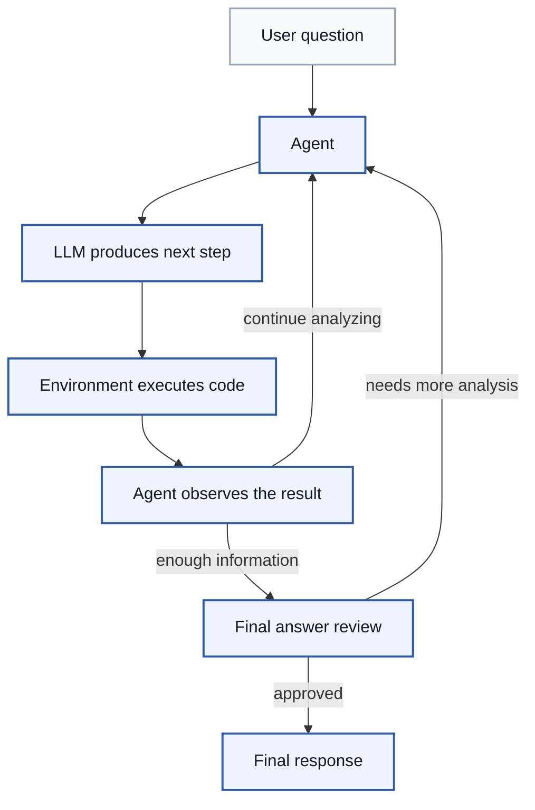
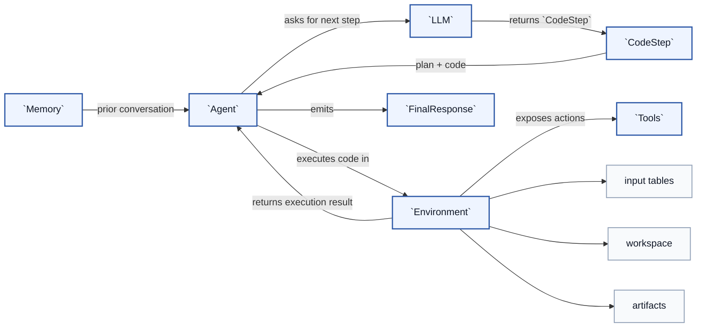

# Data Agent

In our **AI-Powered Data Exploration: Build Your Own Analytics Assistant** Build program, over the course of 6 weeks, we built up the ideas behind a data analytics agent from first principles: prompt engineering, tool calling, ReAct loops, coding agents, and memory.

This repo is the integrated demo of that work.

The notebooks in the Build program were designed to teach the ideas step by step. This repo takes the same core concepts and organizes them into a cleaner application structure:

- the design is cleaner and (hopefully)more readable
- the agent loop is explicit
- the execution runtime is isolated
- the tool surface is small and readable
- the conversation memory is simple
- the UI and API sit on top of the same core runtime


## ReAct Loop

The heart of this repo is a ReAct-style loop:



## Main Abstractions

Conceptually, the core pieces fit together like this:



The main classes are:

- `Agent`
  - coordinates the whole run
  - reads conversation state, asks the LLM for the next step, executes that step, and decides whether to continue or finish

- `CodeStep`
  - one structured step from the LLM
  - contains the plan and the Python code for the next move in the loop

- `Environment`
  - executes generated code
  - owns the input tables, persistent workspace variables, and published artifacts

- `Tools`
  - the action surface available to generated code through the environment

- `Memory`
  - stores conversation history so follow-up questions have context

- `FinalResponse`
  - the final user-facing response emitted when the agent has enough information

## The Most Important Files

If you want to understand the system quickly, read these in order:

1. `agent/agent.py`
2. `agent/environment.py`
3. `agent/tools.py`
4. `agent/prompts.py`
5. `agent/response.py`
6. `tests/test_agent.py`

That path explains most of the runtime behavior.

## Repository Layout

```text
agent/   Core runtime, prompts, tools, sandbox, response models, loaders
api/     FastAPI wrapper around the agent
ui/      React frontend for chat, trace viewing, and artifacts
data/    Sample datasets
tests/   Backend test suite
```

## Setup

### 1. Prerequisites

- OpenAI API key
- Basic familiarity with Python and pandas

If you do not already have an OpenAI API key, ask your Build Fellow for help getting one for this project.

### 2. Clone the repo

```bash
git clone https://github.com/00ber/data-agent.git
cd data-agent
```

### 3. Install `uv`

We use `uv` for fast, reliable Python package management.

Follow the installation instructions here:

https://docs.astral.sh/uv/getting-started/installation/

### 4. Install Python with `uv`

Use `uv` to install Python 3.12:

```bash
uv python install 3.12
```

You can verify the installation with:

```bash
uv run python --version
```

### 5. Install Node.js

You only need Node.js and npm if you want to run the frontend UI.

If Node is not already installed on your machine, install the current LTS version from:

https://nodejs.org/

You can verify the installation with:

```bash
node --version
npm --version
```

### 6. Create the environment file

Copy the sample environment file:

```bash
cp .env.sample .env
```

Open `.env` and add your OpenAI API key:

```env
OPENAI_API_KEY=<add your OpenAI API key here>
```

### 7. Install Python dependencies

```bash
uv sync --extra dev
```

### 8. Install frontend dependencies

```bash
cd ui
npm install
cd ..
```

## Run The Full App

Open two terminals.

### Terminal 1: start the backend

From the repo root:

```bash
uv run uvicorn api.main:app --reload --port 8001
```

Backend URL:

```text
http://localhost:8001
```

### Terminal 2: start the frontend

From the repo root:

```bash
cd ui
npm run dev
```

Frontend URL:

```text
http://localhost:5173
```


## Use The Agent Layer Directly

You can use the core agent directly without the API or UI.

The example below loads two CSV files, creates an agent, and prints the streamed events:

```python
import asyncio
from pathlib import Path

from agent import (
    Agent,
    Environment,
    ExecutionSandbox,
    Memory,
    OpenAILLM,
    Tools,
    load_files,
)


async def main() -> None:
    tables = load_files(
        [
            Path("data/ecommerce/customers.csv"),
            Path("data/ecommerce/orders.csv"),
        ]
    )

    agent = Agent(
        llm=OpenAILLM(model="gpt-4o"),
        memory=Memory(),
        environment=Environment(
            inputs=tables,
            sandbox=ExecutionSandbox(),
        ),
        tools=Tools(),
    )

    async for event in agent.run(
        "Which customer segments spend the most overall?"
    ):
        if event.kind in {"thinking", "reviewing", "result", "error"}:
            print(f"[{event.kind}] {event.data['text']}")
        elif event.kind == "code":
            print("\n# Code")
            print(event.data["text"])
        elif event.kind == "artifact":
            print(
                f"[artifact] {event.data['title']} "
                f"({event.data['kind']})"
            )
        elif event.kind == "answer":
            print("\nFinal response:")
            for block in event.data["blocks"]:
                print(block)


asyncio.run(main())
```

You can save that example as `run_agent.py` and run it with:

```bash
uv run python run_agent.py
```

## Sample Data

The repo includes a few datasets for experimenting with the agent:

- `data/ecommerce/`
- `data/superstore/`
- `data/world_indicators/`

## Suggested Reading After The README

If you came here from the Build notebooks, the shortest path through this repo is:

1. find the loop in `agent/agent.py`
2. see how execution works in `agent/environment.py`
3. inspect the action surface in `agent/tools.py`
4. read the prompt contract in `agent/prompts.py`
5. read the final response model in `agent/response.py`

That gives you the cleanest connection between the workshop concepts and the integrated implementation in this repo.
